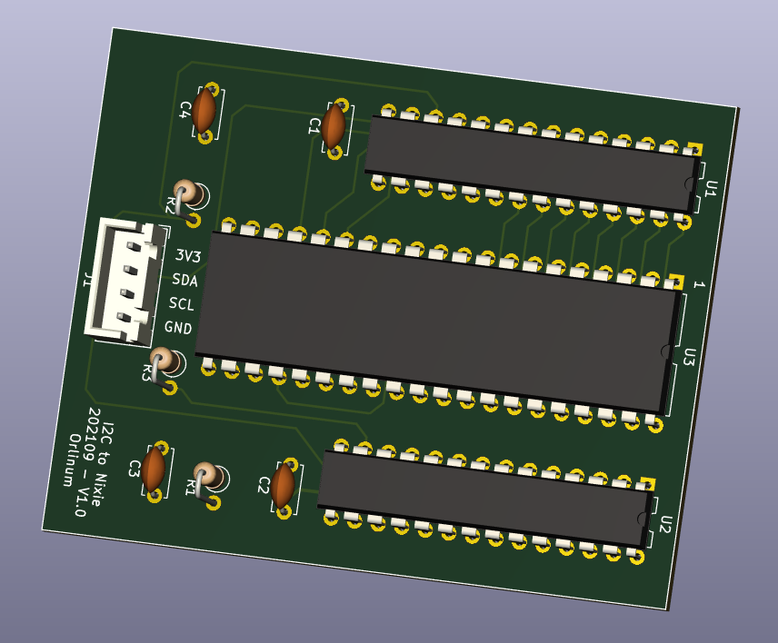

# I2C-to-Nixie
Raspberry Pi Adaptater card for Elektor Nixie Clock

## What is I2C-to-Nixie ?

I2C-to-Nixie is a card which replaces the Microchip PIC18F4420 microcontroller of the kit Elektor Nixie Clock.
Input of this card is an I2C interface allowing to use this board with a Raspberry Pi, an Arduino, or any other equipment able to use the I2C interface.

More information about Elektor Nixie Clock are aviable here : 
https://www.elektormagazine.com/magazine/elektor-201605/28960

## Why replace the microcontroller? 

Elektor Nixie Clock use a GPS chip to know the time.
Sometimes, reception conditions of GPS signal are very weak and do not allow to display the time correctly.

The initial goal of my project is to use a Raspberry PI to get the time in NTP and display it on the vintage nixie IN-12 tubes.

## How it works

Very simple, use two MCP23017 and 16-Bit I2C I/O Expander to convert I2C signal to remplace microcontroller.
2 MCP23017 is used to transmit hours, minutes, second, one led, and two "LA" neon lamp.
Chip U1 channel "B" transmit Minutes Unit (M_Ux) and Minutes Tens (M_Dx). LA1 is connected to the last "B" pin.
Chip U1 channel "A" transmit Seconds Unit (S_Ux) and Seconds Tens (S_Dx). LA2 is connected to the last "A" pin.
Chip U2 channel "A" transmit Hours Unit (H_Ux) and Hours Tens (H_Dx). LED is connected to the last "A" pin.
Chip U2 channel "B" is not connected.

Button and jumper is not use.

R1 and C3 is used to reset two MCP23017 on startup. C1, C2, and C4 are decoupling capacitor. R2 and R3 are pullup resistor, for I2C bus.

