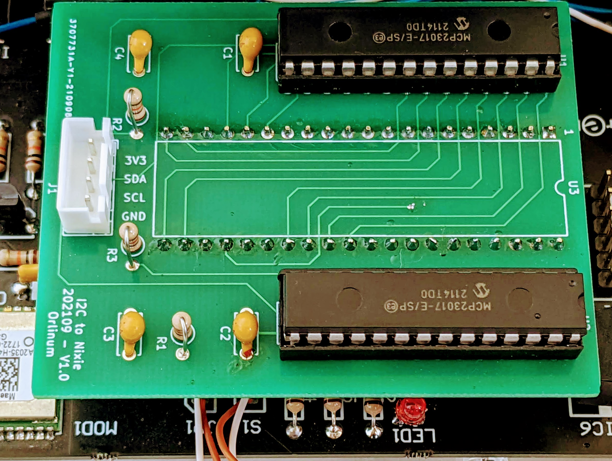
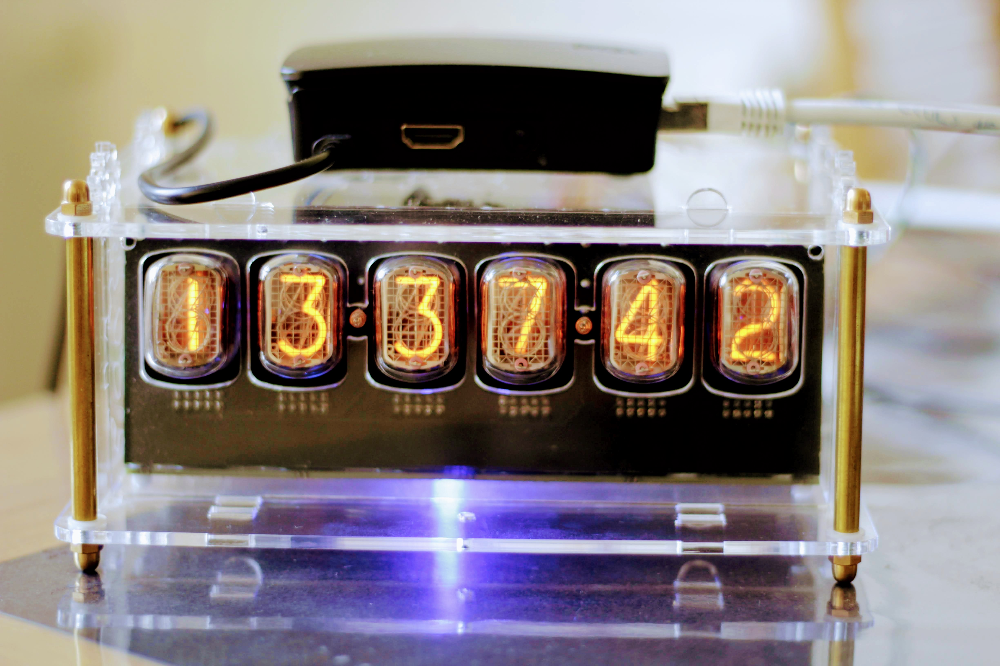
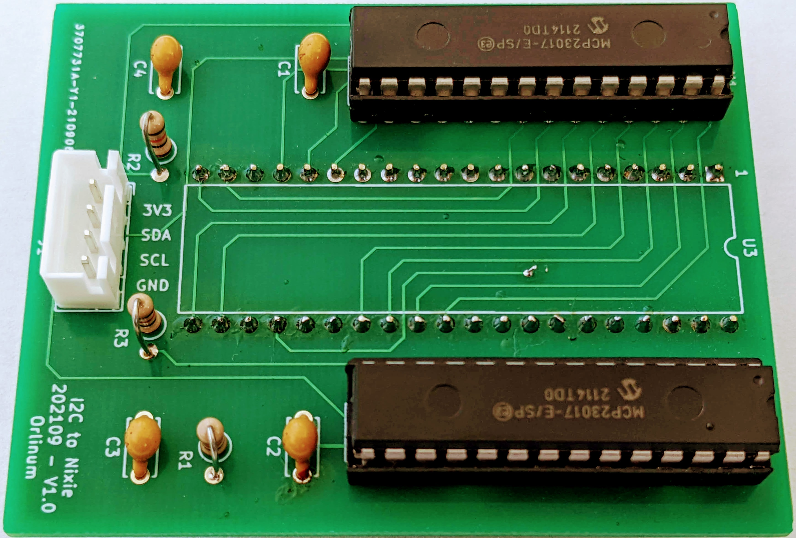
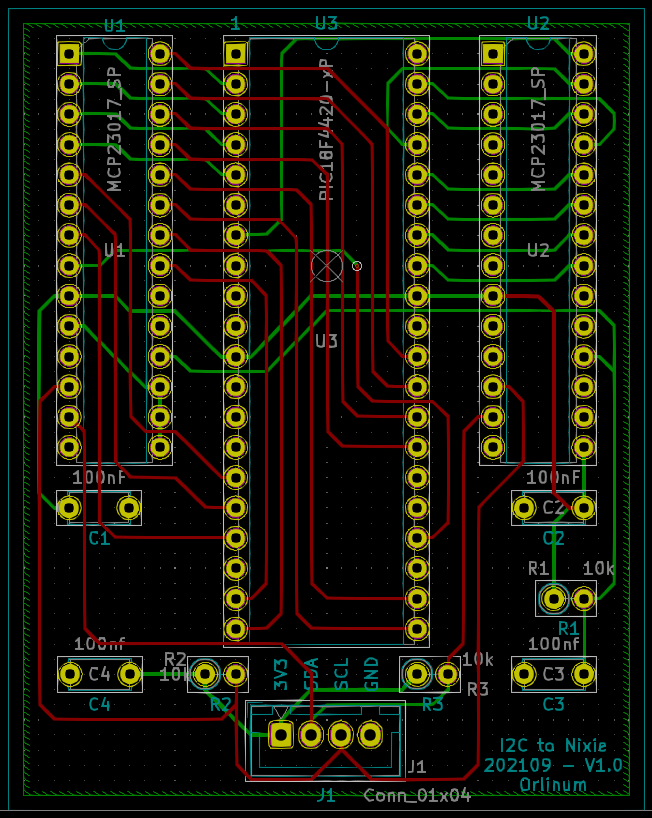

# I2C-to-Nixie
Raspberry Pi Adapter card for Elektor Nixie Clock

Replaces the Microchip PIC18F4420 microcontroller

Clock working with Raspberry PI

## What is I2C-to-Nixie ?
I2C-to-Nixie is a daughter card which replaces the Microchip PIC18F4420 microcontroller of the kit Elektor Nixie Clock.
Input of this card is an I2C interface allowing using this board with a Raspberry Pi, an Arduino, or any other equipment able to use the I2C interface.

Mounted component card

More information about Elektor Nixie Clock is available here :  https://www.elektormagazine.com/magazine/elektor-201605/28960

## Why replace the microcontroller? 
Elektor Nixie Clock use a GPS chip to know the time.
Sometimes, converge conditions (indoor...) of GPS signals are very weak and do not allow display the time correctly.

The initial goal of my project is to use a Raspberry PI to get the time in NTP and display it on the vintage nixie IN-12 tubes.

## How it works

Very simple, use two MCP23017 and 16-Bit I2C I/O Expander to convert I2C signal to replace microcontroller.
Two MCP23017 is used to transmit hours, minutes, seconds, one led, and two "LA" neon lamp.

Chip U1 channel "B" transmit Minutes Unit (M_Ux) and Minutes Tens (M_Dx). LA1 is connected to the last "B" pin.
Chip U1 channel "A" transmit Seconds Unit (S_Ux) and Seconds Tens (S_Dx). LA2 is connected to the last "A" pin.
Chip U2 channel "A" transmit Hours Unit (H_Ux) and Hours Tens (H_Dx). LED is connected to the last "A" pin.
Chip U2 channel "B" is not connected.

Button and jumpers on mothercard are not connected.

R1 and C3 are used to reset two MCP23017 on startup. C1, C2, and C4 are decoupling capacitors. R2 and R3 are pullup resistors, for I2C bus.

## Component list
* C1, C2, C3, C4 : 100nf
* R1, R2, R3 : 10kohms
* U1, U2 : MCP23017-E/SP 
* U3 : Model connector of PIC18F4420 (do not buy a PIC)
* J1 : Connector 01x04

## Software
Yes ! A python software for raspberry pi is writing ... Please be patient. 

## Licence
Creative Commons Zero v1.0 Universal (cc0-1.0)

